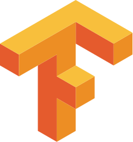
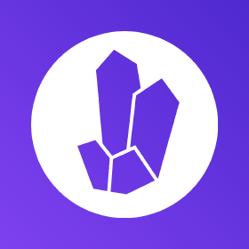
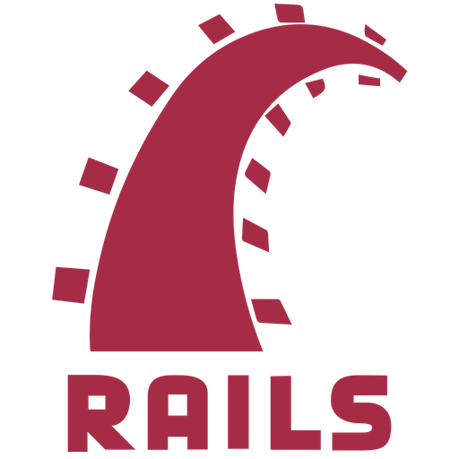
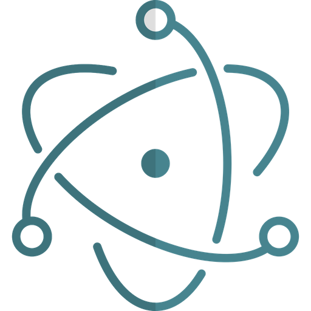
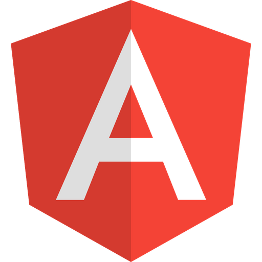
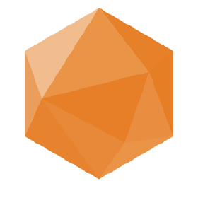
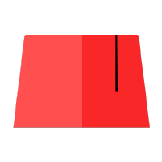

## Hi there, I'm Killidia 👋

### About me:

I am a French developer, passionate about programming, understanding computer systems and cyber security.

### Ideas of project:

- An home assistant with many features like Jarvis 😎.
- A complete dev suite (code editor, git client, database client, etc...) written in Rust and Tauri !

### My favorite Languages:

	
	
	

### Technologies I am familiar with:

	
	
	
	
	
	
	
	
	
	
	
	
	
	

### Tools or framework I am familiar with:

	
	
	
	
	
	
	
	
	
	
	
	
	
	
	
	
	
	
	
	
	
	
	
	
	
	
	
	
	

and many more because i'm very curious ! 😋
